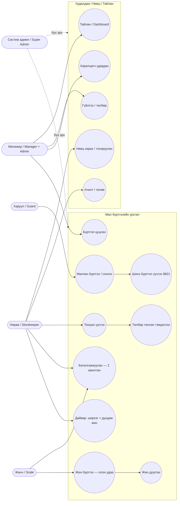
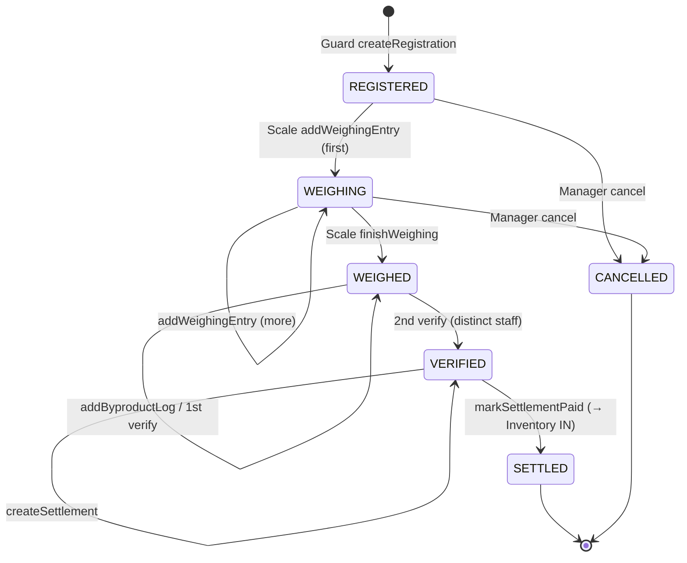
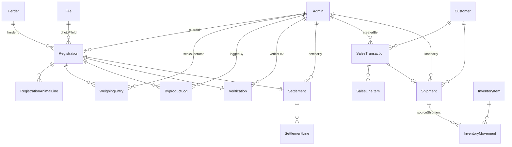
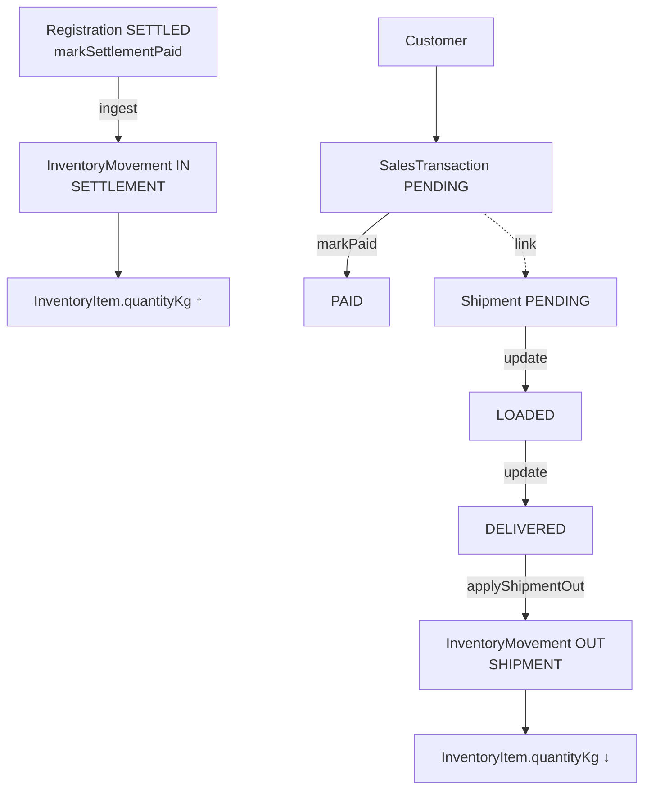

# Meat-Factory ERP — Architecture & Use-Case Guide

> Мах боловсруулах үйлдвэрийн ERP систем — Вайтгрүпп ХХК, гэрээ №001.
> System architecture, domain model, and business logic. Source of truth is the
> code under `src/`; keep this doc updated when models or permissions change.
> Standalone diagram sources live in [`docs/diagrams/`](./diagrams) (`.mmd`,
> render with `npx -y @mermaid-js/mermaid-cli -i <file>.mmd -o <file>.svg`).

---

## 1. Stack

- **Back-end** (this repo): Node + TypeScript, Apollo Server v5 + Express 5,
  Sequelize 6, PostgreSQL. GraphQL is the API surface (`/graphql`); REST remains
  only for `POST /file/upload` and `POST /seed/*`.
- **Front-end** (`../meat-factory-front-end`): Next.js + shadcn/ui + Tailwind + urql.
- **Schema management**: `sequelize.sync({ alter })` at boot (no migration files).
- **Auth**: JWT in the bare `Authorization` header → `@adminAuth(permissions:[...])`
  directive enforces role membership against the live DB role.

---

## 2. Actors & roles

All staff live in **one** `Admin` table; the `role` column drives both auth and which
workflow step a person performs.

| Role | Mongolian | Responsibility |
|---|---|---|
| `GUARD` | Харуул | Gate intake — register incoming livestock |
| `SCALE` | Жинч | Weighing station — record weights, finish weighing |
| `STOREKEEPER` | Нярав | Byproducts, verification, settlement, inventory, shipments |
| `MANAGER` | Менежер | Oversight + customers/sales/shipments/inventory/dashboard, cancel |
| `ADMIN` | Админ | Office operations (customers/sales/dashboard) |
| `MODERATOR` | Модератор | Read/registration view |
| `SUPER_ADMIN` | Систем админ | Everything incl. staff management |

### Permission matrix (enforced server-side per GraphQL operation)

| Use case | Allowed roles |
|---|---|
| `createRegistration` | GUARD, MANAGER, SUPER_ADMIN |
| `addWeighingEntry`, `finishWeighing` | SCALE, MANAGER, SUPER_ADMIN |
| `addByproductLog` | STOREKEEPER, MANAGER, SUPER_ADMIN |
| `verifyRegistration` | STOREKEEPER, SCALE, MANAGER, ADMIN, SUPER_ADMIN (2nd ≠ 1st) |
| `createSettlement`, `markSettlementPaid` | STOREKEEPER, MANAGER, SUPER_ADMIN |
| `cancelRegistration` | MANAGER, SUPER_ADMIN |
| `customers*`, `salesTransactions*`, `dashboard` | MANAGER, ADMIN, SUPER_ADMIN |
| `shipments*`, `inventory*` | + STOREKEEPER |
| `createAdmin`, `updateAdmin` | SUPER_ADMIN, MANAGER |
| `deleteAdmin` | SUPER_ADMIN |

---

## 3. Use-case diagram

Source: [`diagrams/use-case.mmd`](./diagrams/use-case.mmd)



---

## 4. The core workflow — registration status machine

One `Бүртгэлийн дугаар` (e.g. 8821) flows through statuses, each step by a different role.
Source: [`diagrams/state-machine.mmd`](./diagrams/state-machine.mmd)



---

## 5. Entity-Relationship Diagram

Source: [`diagrams/erd.mmd`](./diagrams/erd.mmd)



(The full attribute-level ERD is in [`diagrams/erd.mmd`](./diagrams/erd.mmd).)

---

## 6. Sales / inventory flow

Source: [`diagrams/sales-inventory-flow.mmd`](./diagrams/sales-inventory-flow.mmd)



---

## 7. Model-by-model reference

| Model (table) | Mongolian | What it is / how used |
|---|---|---|
| `Admin` | Ажилтан | All staff in one table; `role` drives auth + workflow step; every action records the actor's id. |
| `File` | Файл/Зураг | Uploaded photo (DigitalOcean Spaces); referenced by `Registration.photoFileId`. |
| `Herder` | Малчин | Supplier: name, регистр, утас, **Малчны данс** (payout bank), хаяг. |
| `Registration` | Бүртгэл | **Aggregate root** — one intake (herder+vehicle+stamp+photo+date+status+sequential №). |
| `RegistrationAnimalLine` | Малын мөр | Count per animal type (Үхэр 2, Хонь 5…); one row per type. |
| `WeighingEntry` | Жин бичлэг | Each scale reading (Түүх): animalType, weightKg, sequenceNo, operator. |
| `ByproductLog` | Дайвар | count (ширхэг) + averageWeightKg (дундаж жин) → stored totalWeightKg. |
| `Verification` | Баталгаажуулалт | Two-employee sign-off (first + second verifier, must differ). |
| `Settlement` | Тооцоо | Money header: meat/byproduct/slaughter totals, gross, **netPayable**, isPaid. |
| `SettlementLine` | Тооцооны мөр | Per-animal breakdown (Няравын тооцоо screen). |
| `Customer` | Харилцагч | Buyer (e.g. "Bashtian Butchin Co."). |
| `SalesTransaction` | Гүйлгээ | Sale, code `NNNN-NNNN`, amount, PAID/PENDING. |
| `SalesLineItem` | Гүйлгээний мөр | MEAT(animalType) or BYPRODUCT(byproductType), qty × unitPrice. |
| `Shipment` | Ачилт | Outbound delivery, forward-only PENDING→LOADED→DELIVERED. |
| `InventoryItem` | Нөөц | Running balance per SKU (`MEAT:COW`), never negative. |
| `InventoryMovement` | Хөдөлгөөн | Immutable ledger: IN/OUT/ADJUSTMENT + balanceAfterKg. |

Enums: `ANIMAL_TYPE` = COW, SHEEP, HORSE, GOAT, CAMEL, CALF · `BYPRODUCT_TYPE` =
HEART, LUNG, LIVER, KIDNEY, STOMACH, INTESTINE, TONGUE, HEAD, TAIL, LEG, BLOOD, HIDE, OTHER.

---

## 8. Business logic (the rules)

1. **Status guards** — each mutation is legal only in specific statuses (byproducts only
   in `WEIGHED`; settlement only from `VERIFIED`). See
   `src/controller/livestock/registration.controller.ts`.
2. **Two-person verification** — `verifyRegistration` is called twice; the 2nd caller must
   differ from the 1st (`context.id` check). The 2nd signature flips status to `VERIFIED`.
3. **Settlement formula** (per animal type):
   - `received = Σ WeighingEntries.weightKg(type)`
   - `meatAmount = received × pricePerKg`
   - `byproductAmount = (Σ ByproductLogs.totalWeightKg × received / Σreceived) × byproductPricePerKg`
     — byproduct value is allocated by each type's received-weight share.
   - `grossAmount = Σmeat + Σbyproduct` ; **`netPayable = gross − ΣslaughterCost`**
   - All DECIMALs are `Number()`-wrapped (pg returns strings).
4. **Inventory is a ledger** — stock moves **IN only when a settlement is paid**, **OUT only
   when a shipment is delivered**. Both are **idempotent** (keyed on
   `sourceRegistrationId` / `sourceShipmentId`) and **negative-stock-guarded under a row
   lock**. See `src/controller/inventory/inventory.controller.ts`.
5. **Race-safe human codes** — `registrationNumber` from Postgres sequence
   `registration_number_seq` (starts 8821); `transactionCode` / `shipmentCode` are
   `NNNN-NNNN` via DB unique index + retry (never `MAX()+1`).
6. **Auth is server-truth** — every mutation is gated by `@adminAuth(permissions:[...])`;
   the front-end role split is UX only.

---

## 9. Run & seed (dev)

```bash
# DB: dockerized Postgres (host port 5434) OR a local Postgres on 5432 (see .env.local)
docker compose up -d postgres      # if using the docker DB
npm run dev                        # nodemon -> http://localhost:8086 , /graphql
curl -X POST http://localhost:8086/seed/admin   # SUPER_ADMIN (admin@example.com / SEED_ADMIN_PASSWORD)
curl -X POST http://localhost:8086/seed/staff   # one user per operational role
```

Seeded staff (dev): `manager@`, `guard@`, `scale@`, `store@` `example.com`,
password = `SEED_ADMIN_PASSWORD`.
